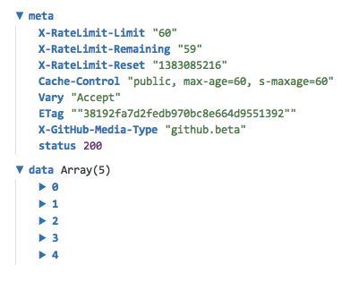

## Inspector JSON

Explore JSON in style.



Inspector JSON is a javascript library for creating "inspectable" representations of JSON, much like the inspection features in web browsers like Google Chrome, Firefox, and Opera. It allows you to collapse/expand arrays and objects, and can even remember the state of the inspector between pageloads.

[](https://ci.testling.com/SparkartGroupInc/Inspector-JSON)

=====

### Usage

> NOTE: You must include `inspector_json.css` for the inspector to be properly styled.

The inspector is started by creating a new `InspectorJSON` instance. If you pass the `json` option, or the `element` provided has a JSON string inside of it, Inspector JSON will automatically render that JSON.

```javascript
var inspector = new InspectorJSON({
    element: 'json',
    json: '{"hello":"world"}'
});
```

You may also render new JSON at any time by using the `view` method:

```javascript
inspector.view('{"new":true}');
```

Inspector JSON can be used as a standalone script, with [Browserify](https://github.com/substack/node-browserify), or with [RequireJS](http://requirejs.org/).

=====

### Configuration

Inspector JSON has a few configuration options, all of which are set in a configuration object passed when the inspector is instantiated. The options are as follows:

| Option | Type | Default | Purpose |
| ----- | ----- | ----- | ----- |
| **element** | `String` or `Element` | `null` | The element the inspector should be rendered in. This must either be the ID of an element, or the element reference itself. |
| **json** | `String` or `Object` | `null` | The JSON for the inspector to render. This must either be a valid JSON string, or an object representing valid JSON. |
| **collapsed** | `Boolean` | `true` | Whether or not the tree will start collapsed |
| **url** | `String` | `location.pathname` | The URL to be used for remembering the inspector's collapse state. By default this uses the page's current URL |

```javascript
var inspector = new InspectorJSON({
    element: 'json',
    json: '{"hello":"world"}',
    collapsed: false,
    url: '/json/inspector/'
});
```

=====

### Methods

Inspector JSON only makes two methods available at the moment:

#### inspector.view( _json_ )
Views the JSON string/object passed.

```javascript
inspector.view('{"string":"Hello World!","number":5,"boolean":true,"array":["one","two","three"],"object":{"key":"value","key2":"value2"}}');

inspector.view({hello:'world'});
```

#### inspector.destroy()
Destroys the inspector.

```javascript
inspector.destroy();
```

=====

### License

Inspector JSON is available under the MIT License.